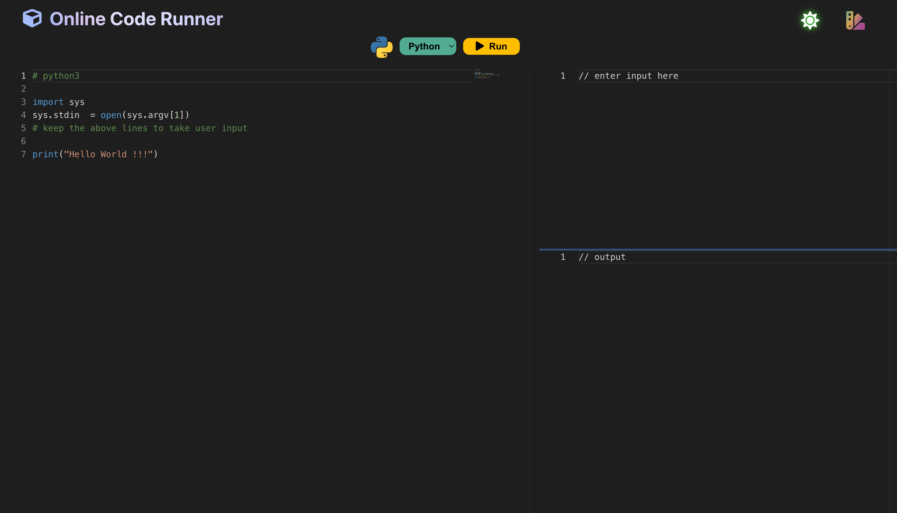
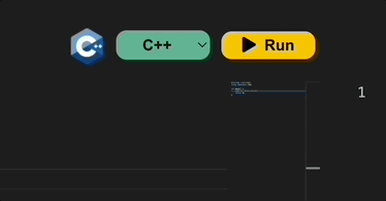
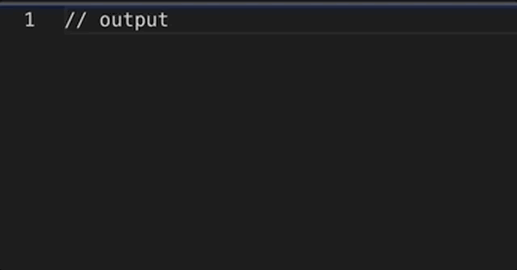
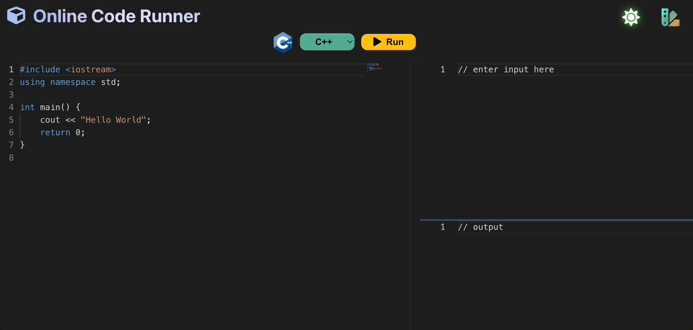

<div align="center">

# Online Code Runner

**A browser-based code editor that compiles and executes C++ and Python on a server and streams the result back to the editor.**



[](LICENSE)
[](https://nodejs.org)
[](https://react.dev)
[](https://expressjs.com)

</div>

---

## Table of Contents

- [Overview](#overview)
- [Features](#features)
- [Tech Stack](#tech-stack)
- [Architecture](#architecture)
  - [Request Lifecycle](#request-lifecycle)
  - [Directory Structure](#directory-structure)
- [Prerequisites](#prerequisites)
- [Installation](#installation)
  - [1. Clone the repository](#1-clone-the-repository)
  - [2. Install the toolchains](#2-install-the-toolchains)
  - [3. Start MongoDB and Redis](#3-start-mongodb-and-redis)
  - [4. Install and run the backend](#4-install-and-run-the-backend)
  - [5. Install and run the frontend](#5-install-and-run-the-frontend)
- [Environment &amp; Configuration](#environment--configuration)
- [Running the Tests](#running-the-tests)
- [API Reference](#api-reference)
  - [`POST /run`](#post-run)
  - [`GET /status`](#get-status)
  - [Job document schema](#job-document-schema)
- [How Code Execution Works](#how-code-execution-works)
  - [C++ pipeline](#c-pipeline)
  - [Python pipeline](#python-pipeline)
  - [Reading stdin](#reading-stdin)
- [UI Walkthrough](#ui-walkthrough)
- [Troubleshooting](#troubleshooting)
- [Security Notice](#security-notice)
- [Known Limitations](#known-limitations)
- [Extending the Project](#extending-the-project)
- [Contributing](#contributing)
- [License](#license)
- [Acknowledgements](#acknowledgements)

---

## Overview

**Online Code Runner** is a full-stack web application that lets you write code in a browser, hit *Run*, and see the compiled output — without installing a compiler or terminal locally.

It is built as a two-part workspace:

| Part | Folder | Stack | Default port |
| --- | --- | --- | --- |
| **Frontend** — the editor UI | `client/` | React 18 + Monaco Editor + Axios | `3000` |
| **Backend** — the compile/execute service | `backend/` | Node.js + Express + Bull + MongoDB | `5000` |

The browser never executes anything. It posts source code to the backend, which writes it to disk, hands it to a background queue, compiles and runs it with the system toolchain (`g++` / `python3`), and records the result in MongoDB. The client then polls the job until it finishes and renders the output.

---

## Features

- **Two languages out of the box** — C++ and Python, selectable from a dropdown in the toolbar.
- **Monaco Editor integration** — the same editor engine used by VS Code, with per-language syntax highlighting, folding, and IntelliSense-free lightweight configuration.
- **Standard input support** — a dedicated input pane feeds your program's `stdin`.
- **Standard output panel** — program output *and* compiler/interpreter errors are displayed inline.
- **Live execution status** — the client polls the backend every second and shows `Running → Success | Error` as the job progresses.
- **Job tracking** — every submission gets a MongoDB document with `submittedAt`, `startedAt`, `completedAt`, `status`, and `output`, so results are inspectable after the fact.
- **Background queue** — Bull (backed by Redis) runs **5 concurrent workers**, so submissions are decoupled from the HTTP request and cannot block the API.
- **Light/dark theme** — toggles the whole app, including the Monaco editor theme, between `vs-dark` and `vs-light`.
- **Starter snippets** — each language loads a sensible default stub, so the editor is never empty.
- **No auth, no database seeding** — clone, install, run.

---

## Tech Stack

### Frontend (`client/`)

| Package | Version | Role |
| --- | --- | --- |
| `react` / `react-dom` | ^18.2.0 | UI runtime |
| `react-scripts` | 5.0.1 | Create React App build/dev server |
| `@monaco-editor/react` | ^4.4.6 | Monaco editor wrapper |
| `monaco-editor` | ^0.34.1 | The editor engine itself |
| `axios` | ^1.2.1 | HTTP client for `/run` and `/status` |
| `moment` | ^2.29.4 | Date formatting utilities |
| `@testing-library/*` | ^13.x | Unit testing utilities |

### Backend (`backend/`)

| Package | Version | Role |
| --- | --- | --- |
| `express` | ^4.18.2 | HTTP API |
| `mongoose` | ^6.8.1 | MongoDB ODM + `Job` model |
| `bull` | ^4.10.2 | Redis-backed job queue |
| `cors` | ^2.8.5 | Cross-origin access for the dev client |
| `uuid` | ^9.0.0 | Unique per-submission file names |
| `nodemon` | ^2.0.20 | Dev-only auto-restart |

### External services & toolchains

| Dependency | Why it's needed |
| --- | --- |
| **MongoDB** | Persists every `Job` document and serves the `/status` endpoint. |
| **Redis** | Backing store for the Bull queue. |
| **GCC** (`g++`) with C++20 (`-std=c++2b`) | Compiles and runs the C++ submissions. |
| **Python 3** (`python3` on PATH) | Interprets the Python submissions. |

---

## Architecture

```
┌──────────────────────────────┐
│        Browser (React)       │
│  Monaco editor + theme + Run │
└──────────────┬───────────────┘
               │  POST /run   { language, code, input }
               │  GET  /status?id=<jobId>   (polled every 1s)
               ▼
┌──────────────────────────────┐
│     Express API  :5000       │
│  1. generateFile()  → writes │
│     codes/<uuid>.<ext>       │
│     inputs/<uuid>.txt        │
│  2. new Job({...}).save()    │
│  3. addJobToQueue(jobId)  →  │
│     responds 201 + jobId     │
└──────────────┬───────────────┘
               │  Bull enqueue
               ▼
┌──────────────────────────────┐
│   Bull queue  "job-queue"    │
│   Redis · 5 workers          │
│  executeCpp() | executePython│
│      └─ g++ / python3        │
└──────────────┬───────────────┘
               │ status + output written back
               ▼
┌──────────────────────────────┐
│         MongoDB              │
│   db: compiler · coll: jobs  │
└──────────────────────────────┘
```

### Request Lifecycle

1. The user clicks **Run**. React posts `{ language, code, input }` to `POST /run`.
2. `generateFile()` writes the source to `backend/codes/<uuid>.<ext>` and the input to `backend/inputs/<uuid>.txt`, returning both paths.
3. A `Job` document is created in MongoDB and its `_id` is pushed onto the Bull queue.
4. The API immediately returns **`201 {"success": true, "jobId": "..."}`** — the compile has not happened yet.
5. A Bull worker picks the job up, sets `status = "Running"` and `startedAt`, and shells out to the compiler/interpreter.
6. On completion the worker writes `status = "Success" | "Error"`, `completedAt`, and `output`, then saves.
7. Meanwhile the client polls `GET /status?id=<jobId>` once per second, updating the output pane until the status leaves `Running`.

### Directory Structure

```
.
├── LICENSE                       # MIT
├── README.md
├── .gitignore                    # node_modules, generated sources, builds
│
├── client/                       # ── React frontend ──
│   ├── package.json
│   ├── public/
│   │   ├── index.html
│   │   ├── manifest.json
│   │   ├── robots.txt
│   │   ├── styles.css
│   │   └── favicon.ico
│   └── src/
│       ├── App.js                # main component: state, submit, polling
│       ├── App.css               # layout + light/dark theme classes
│       ├── index.js              # React entry point
│       ├── index.css
│       ├── defaultStubs.js       # starter snippet per language
│       └── resources/            # language icons (cpp.png, python.png, …)
│
├── backend/                      # ── Express API + worker ──
│   ├── package.json
│   ├── index.js                  # Express app, Mongo connection, routes
│   ├── jobQueue.js               # Bull queue, 5 workers, status transitions
│   ├── generateFile.js           # writes codes/ and inputs/ files
│   ├── executeCpp.js             # g++ compile + run
│   ├── executePython.js          # python3 run
│   ├── createInput.js            # (placeholder, currently empty)
│   ├── models/
│   │   └── Job.js                # Mongoose schema for a submission
│   ├── codes/                    # generated — gitignored
│   ├── inputs/                   # generated — gitignored
│   └── outputs/                  # generated — gitignored
│
└── media/                        # Screenshots & GIFs used by this README
    ├── app-screengrab.png
    ├── execution-status.gif
    ├── language-selection.gif
    ├── theme-change.gif
    └── theme-switch.gif
```

---

## Prerequisites

Install all of the following before starting.

| Requirement | Minimum version | Notes |
| --- | --- | --- |
| **Node.js** | 18 LTS or newer | Ships with `npm`. |
| **npm** | 9+ | Comes with Node. |
| **MongoDB** | 5.0+ | Local install, Docker, or Atlas. |
| **Redis** | 6+ | Required by Bull. |
| **GCC (`g++`)** | 10+ | Needs C++20 support for `-std=c++2b`. |
| **Python 3** | 3.8+ | Must be reachable as `python3` on `PATH`. |
| **Git** | any | To clone the repository. |

Quick check of the non-Node tooling:

```bash
g++ --version
python3 --version
mongod --version
redis-server --version
```

---

## Installation

### 1. Clone the repository

```bash
git clone https://github.com/<your-username>/online-code-runner.git
cd online-code-runner
```

### 2. Install the toolchains

**GCC** — macOS:

```bash
xcode-select --install
```

Ubuntu / Debian:

```bash
sudo apt update && sudo apt install -y build-essential
```

**Python 3** — macOS (Homebrew):

```bash
brew install python3
```

Ubuntu / Debian:

```bash
sudo apt install -y python3
```

### 3. Start MongoDB and Redis

**macOS (Homebrew):**

```bash
brew services start mongodb-community
brew services start redis
```

**Linux (systemd):**

```bash
sudo systemctl start mongod
sudo systemctl start redis-server
```

**Docker (any OS):**

```bash
docker run -d --name ocr-mongo -p 27017:27017 mongo:6
docker run -d --name ocr-redis -p 6379:6379 redis:7
```

### 4. Install and run the backend

```bash
cd backend
npm install
npm run dev
```

Expected output:

```
Successfully connected to mongodb database
Listening on port 5000
```

`npm run dev` uses `nodemon` and reloads the server on every file change. For a plain production-style run use `npm start` instead.

### 5. Install and run the frontend

In a **second terminal**, from the repository root:

```bash
cd client
npm install
npm start
```

The app compiles and opens at <http://localhost:3000>. Select a language, edit the code, and press **Run**.

---

## Environment &amp; Configuration

The project currently hardcodes its defaults, so a fresh clone needs no configuration. The values that matter are:

| Setting | Current value | Where |
| --- | --- | --- |
| MongoDB connection | `mongodb://0.0.0.0/compiler` | `backend/index.js` |
| MongoDB database name | `compiler` | `backend/index.js` |
| Bull queue name | `job-queue` | `backend/jobQueue.js` |
| Concurrent workers | `5` | `backend/jobQueue.js` (`WORKERS`) |
| API base URL | `http://localhost:5000` | `client/src/App.js` |
| API port | `5000` | `backend/index.js` |
| Client port | `3000` | Create React App default |
| C++ standard | `-std=c++2b` (C++20) | `backend/executeCpp.js` |
| Generated sources | `backend/codes/` | `backend/generateFile.js` |
| Generated inputs | `backend/inputs/` | `backend/generateFile.js` |
| Compiled binaries | `backend/outputs/` | `backend/executeCpp.js` |

If you need to point at a remote database or a different port, edit the corresponding constant — the values are listed above for quick reference.

---

## Running the Tests

**Backend** — no test suite is configured yet; the placeholder script exits non-zero by design:

```bash
cd backend
npm test
```

**Frontend** — Create React App ships a Jest + React Testing Library harness. `npm test` opens watch mode; add the flags below to run it once or in CI:

```bash
cd client
npm test                      # watch mode
npm test -- --watchAll=false   # single run
CI=true npm test              # CI mode
```

---

## API Reference

Base URL: `http://localhost:5000`

### `POST /run`

Queues a submission for compilation and execution. Returns immediately — the job has only been *created*, not yet *run*.

**Request body**

| Field | Type | Required | Default | Description |
| --- | --- | --- | --- | --- |
| `code` | `string` | **yes** | — | The source code to execute. |
| `input` | `string` | no | `""` | Text piped to the program's standard input. |
| `language` | `string` | no | `"python"` | Either `cpp` or `python`. |

**`201 Created`**

```json
{
  "success": true,
  "jobId": "653f1a2b9c1d4e2a8b7c6d5e"
}
```

**`400 Bad Request`** — no `code` field:

```json
{ "success": false, "error": "Empty code body" }
```

**`500 Internal Server Error`**

```json
{ "success": false, "err": "{\"message\":\"…\"}" }
```

**Example**

```bash
curl -X POST http://localhost:5000/run \
  -H "Content-Type: application/json" \
  -d '{
        "language": "python",
        "code": "import sys\nfor line in sys.stdin:\n    print(line.strip().upper())",
        "input": "hello\nworld"
      }'
```

### `GET /status`

Returns the current state of a submission. The client polls this endpoint once per second.

**Query parameters**

| Param | Type | Required | Description |
| --- | --- | --- | --- |
| `id` | `string` | **yes** | The `jobId` returned by `POST /run`. |

**`200 OK`**

```json
{
  "success": true,
  "job": {
    "_id": "653f1a2b9c1d4e2a8b7c6d5e",
    "language": "python",
    "filepath": "…/backend/codes/0f0b….py",
    "inputFilePath": "…/backend/inputs/0f0b….txt",
    "submittedAt": "2023-11-28T10:15:00.000Z",
    "startedAt": "2023-11-28T10:15:01.000Z",
    "completedAt": "2023-11-28T10:15:01.240Z",
    "status": "Success",
    "output": "HELLO\nWORLD\n",
    "__v": 0
  }
}
```

**`400 Bad Request`** — `id` missing or not a valid ObjectId:

```json
{ "success": false, "error": "{\"message\":\"…\"}" }
```

**`404 Not Found`** — well-formed id that matches no job:

```json
{ "success": false, "error": "invalid job id" }
```

**Status values** — `Running` while a worker is busy, then `Success` or `Error`. On `Error`, `output` holds a JSON string of `{ error, stderr }`, which the client parses and displays as `stderr`.

**Example**

```bash
curl "http://localhost:5000/status?id=653f1a2b9c1d4e2a8b7c6d5e"
```

### Job document schema

`backend/models/Job.js`

| Field | Type | Required | Default | Notes |
| --- | --- | --- | --- | --- |
| `language` | String | yes | — | Enum: `cpp`, `python`. |
| `filepath` | String | yes | — | Absolute path to the generated source file. |
| `inputFilePath` | String | yes | — | Absolute path to the generated input file. |
| `submittedAt` | Date | no | `Date.now` | Set when the job is created. |
| `startedAt` | Date | no | — | Set by the worker just before execution. |
| `completedAt` | Date | no | — | Set by the worker after execution. |
| `output` | String | no | — | `stdout` on success; JSON error string on failure. |
| `status` | String | no | `Running` | Enum: `Running`, `Success`, `Error`. |

---

## How Code Execution Works

### C++ pipeline

`backend/executeCpp.js` runs a single shell command per submission:

```bash
g++ -std=c++2b -DLOCAL_MACHINE <codes>/<uuid>.cpp -o <outputs>/<uuid>.out \
  && cd <outputs> && ./<uuid>.out < <inputs>/<uuid>.txt
```

- `-std=c++2b` selects C++20 (GCC's name for the draft).
- `-DLOCAL_MACHINE` is a convenience define if you want to branch on local vs sandboxed builds.
- The binary is executed with the working directory set to `outputs/`, and stdin redirected from the generated input file.

### Python pipeline

`backend/executePython.js`:

```bash
python3 <codes>/<uuid>.py <inputs>/<uuid>.txt
```

The interpreter receives the input file's path as `sys.argv[1]` rather than on stdin, so the **default stub** wires it up explicitly:

```python
import sys
sys.stdin = open(sys.argv[1])
```

### Reading stdin

If you'd rather read standard input normally, the shell redirect is what feeds it — and for C++ no extra work is needed. For Python, either keep the two lines above or read the file directly:

```python
import sys
data = open(sys.argv[1]).read()
print(data.upper())
```

---

## UI Walkthrough

**Application**


**Switching between Python and C++**

Switching the dropdown swaps the syntax highlighting, the language icon, and the starter snippet in one step.



**Watching execution status**

After pressing *Run*, the output pane shows `Code Execution Status: Running` and flips to `Success` or `Error` as soon as the worker finishes.



**Toggling the theme**

The sun/moon icon switches the chrome and the Monaco theme between light and dark at once.



---

## Troubleshooting

<details>
<summary><b>The client can't reach the backend ("Error connecting to server!")</b></summary>

The backend is not running, or it crashed on startup. Confirm you see `Listening on port 5000` in the backend terminal. Note that `App.js` hardcodes `http://localhost:5000` — if you changed the port, update it there too.
</details>

<details>
<summary><b>Backend exits immediately / "Successfully connected to mongodb database" never prints</b></summary>

MongoDB isn't reachable at `mongodb://0.0.0.0/compiler`. Start it, or point the connection string in `backend/index.js` at your instance. The process calls `process.exit(1)` on a failed connection, so a silent exit with no log usually means the database is down.
</details>

<details>
<summary><b>Jobs stay "Running" forever</b></summary>

Redis isn't running, so Bull has nowhere to enqueue. Start Redis (`redis-cli ping` should answer `PONG`) and restart the backend.
</details>

<details>
<summary><b>`'python3' is not recognized` (Windows)</b></summary>

`executePython.js` invokes `python3`. On Windows the launcher is usually `python` or `py`. Either add a `python3` alias/shim to your `PATH`, or change the command string in `backend/executePython.js` to match your environment.
</details>

<details>
<summary><b>C++ jobs fail with a compiler error</b></summary>

Confirm your GCC supports C++20: `g++ -std=c++2b -dumpversion`. Older GCC versions only know `-std=c++17`. The real error text is the job's `stderr`, which the client displays in the output pane.
</details>

<details>
<summary><b>`MongooseError: Cannot read properties of undefined (reading 'use')</b></summary>

`backend/models/Job.js` ends with `new mongoose.model("job", JobSchema)`. The `new` keyword is wrong for a Mongoose model registration call and should be removed — it becomes `mongoose.model("job", JobSchema)`.
</details>

<details>
<summary><b>The generated `codes/`, `inputs/`, and `outputs/` folders are filling up</b></summary>

Nothing deletes them. Each submission leaves a source file, an input file, and (for C++) a compiled binary behind. Clear them periodically; all three are gitignored.
</details>

<details>
<summary><b>Port already in use (3000 / 5000)</b></summary>

Stop the process holding the port, or set `PORT=3001` in `client/.env` for the frontend and change the `listen()` port in `backend/index.js` for the API.
</details>

---

## Security Notice

**This project executes arbitrary user-submitted code on the machine running the backend, with your OS user account's privileges and no sandboxing.**

That is by design — it is a compiler playground — but it makes the project **unsafe to expose to the public internet as-is**. Before deploying anything beyond `localhost`, be aware of the following:

- **No execution sandbox.** Submissions run through `child_process.exec` as your own user, with full filesystem and network access.
- **No resource limits.** There is no timeout, memory cap, or process-count limit. A submission can fork-bomb, fill the disk, or run forever.
- **Shell command construction.** The compiler and interpreter commands are built as strings. The filename is UUID-generated (safe), but any change that lets a user influence part of that string is a command-injection risk.
- **No authentication or rate limiting.** `POST /run` is open to anyone who can reach the port.
- **CORS is fully permissive** (`app.use(cors())`).

To harden it for real use, run each job inside a container or VM with a network namespace, memory/CPU/pid limits, a wall-clock timeout, a read-only filesystem, a non-root user, and drop `exec` in favour of `execFile`/`spawn` with an argument array. Put authentication and rate limiting in front of `/run`. Never expose this backend directly to the internet.

---

## Known Limitations

- **No execution timeout.** A non-terminating program keeps its worker slot occupied; with 5 workers the queue stalls until the process exits on its own.
- **No automatic cleanup** of `codes/`, `inputs/`, and `outputs/`.
- **Polling only.** The client uses `setInterval` at 1s rather than WebSockets or SSE, so a fast job can report late and a finished job is only noticed on the next tick.
- **No result history in the UI.** Job documents persist in MongoDB, but there is no list view.
- **No test suite.** Neither the API routes nor the execution pipeline are covered by automated tests.
- **Frontend and backend are hardcoded to localhost**, so the app does not work as-is once split across two hosts without edits.
- **The frontend is a single component.** All state, polling, and theme toggling live in `client/src/App.js`.

---

## Extending the Project

**Add a new language** — three small changes:

1. `backend/models/Job.js` — add the value to the `language` enum.
2. `backend/generateFile.js` — add the file extension to `languageFileExtension`.
3. Add an `execute<Language>.js` module and branch in `backend/jobQueue.js` next to the `executeCpp` check.
4. `client/src/defaultStubs.js` — add a `stubs.<language>` snippet.
5. `client/src/App.js` — add an `<option>` to the language `<select>` and drop an icon in `client/src/resources/`.

**Change the concurrency** — edit `WORKERS` in `backend/jobQueue.js`.

**Add authentication** — put a guard middleware in front of `/run` in `backend/index.js`, and send the credential from `handleSubmit` in `client/src/App.js`.

**Replace polling with WebSockets** — emit a job-status event from the Bull worker's completion handler in `backend/jobQueue.js`, and subscribe to it in `client/src/App.js` instead of the `setInterval` loop.

---

## Contributing

Contributions are welcome. To contribute:

1. **Fork** the repository and create a branch off `main`.
2. **Install and run** both apps locally as described in [Installation](#installation).
3. **Keep node_modules out of commits** — the root `.gitignore` already covers `node_modules/` plus the generated `codes/`, `inputs/`, and `outputs/` directories.
4. **Match the existing style** — 4-space indentation, `const`/`let`, ES modules on the frontend and CommonJS on the backend, double-quoted strings.
5. **Open a pull request** describing what changed and why.

By contributing you agree that your work is licensed under the [MIT License](LICENSE).

---

## License

Released under the MIT License.

```
MIT License

Copyright (c) 2023 Jigyansu Nanda
```

See [LICENSE](LICENSE) for the full text.

---

## Acknowledgements

- **Monaco Editor** — the editor engine behind VS Code, wrapped for React by `@monaco-editor/react`.
- **Bull** — Redis-backed job queueing for Node.js.
- **Mongoose** — MongoDB object modelling for Node.js.
- **Create React App** — the frontend toolchain.
- **Jigyansu Nanda** — the original author of this project.

Happy coding.
